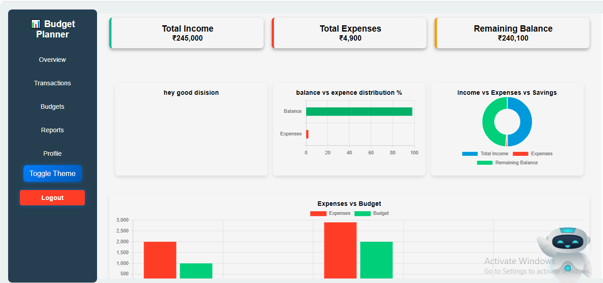
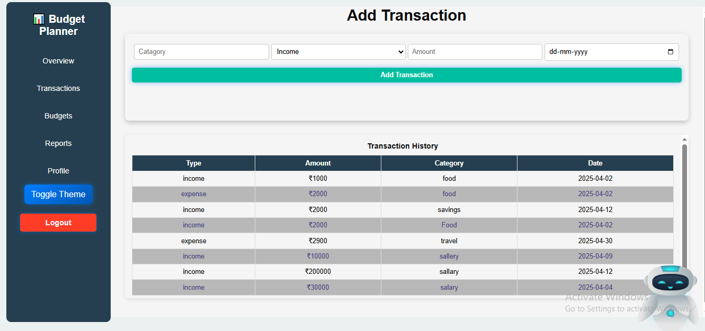
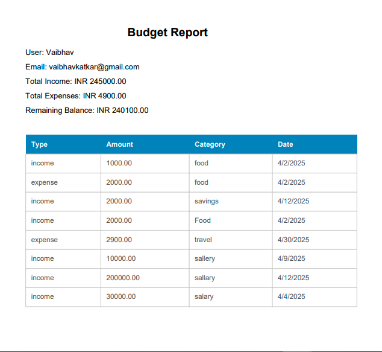

# Budget Planner With AI 🤖💰

A comprehensive budget management application with AI-powered assistance to help users track expenses, manage budgets, and get financial insights.



## ✨ Features

### 🔐 Authentication
- Secure user registration and login
- Session-based authentication with MongoDB storage
- Password hashing with bcryptjs

### 💹 Transaction Management
- Add income and expense transactions
- Categorize transactions (food, transport, shopping, etc.)
- View transaction history
- Delete transactions

### 📊 Budget Management
- Set monthly budgets per category
- Track spending against budget limits
- Visual budget progress indicators
- Automatic budget category creation

### 🤖 AI-Powered Assistant
- Google Gemini AI integration
- Natural language transaction entry
- Smart budget recommendations
- Financial insights and advice
- Chat history for reference

### 📈 Reports & Analytics
- Monthly expense charts
- Category-wise spending breakdown
- Income vs Expenses comparison
- Savings calculation

### 👤 Profile Management
- User profile customization
- Avatar upload support
- Secure logout

## 🛠 Tech Stack

- **Backend**: Node.js, Express.js
- **Database**: MongoDB with Mongoose
- **Templating**: EJS (Embedded JavaScript)
- **Authentication**: Express-session, bcryptjs
- **AI Integration**: Google Gemini API
- **File Upload**: Multer
- **Frontend**: HTML, CSS, JavaScript, Chart.js

## 📁 Project Structure

```
Budget-Planner-With-A/
├── ai/
│   └── getAIResponse.js         # AI chatbot integration
├── controllers/
│   └── profileController.js     # Profile management
├── models/
│   ├── Budget.js               # Budget schema
│   ├── Transaction.js           # Transaction schema
│   └── User.js                 # User schema
├── public/
│   ├── js/script.js            # Main JavaScript
│   ├── Schema/                 # Additional schemas
│   ├── scripts/                # Feature-specific scripts
│   └── styles/                 # CSS stylesheets
├── routes/
│   ├── auth.js                 # Authentication routes
│   ├── isAuth.js               # Auth middleware
│   └── profile.js              # Profile routes
├── views/                      # EJS templates
│   ├── index.ejs               # Dashboard
│   ├── budget.ejs              # Budget page
│   ├── transaction.ejs         # Transaction page
│   ├── report.ejs              # Reports page
│   ├── profile.ejs             # Profile page
│   ├── login.ejs               # Login page
│   └── register.ejs            # Registration page
├── images/                     # Application screenshots
│   ├── Home.png                # Dashboard screenshot
│   ├── Transaction.png         # Transaction page screenshot
│   └── BudgetReport.png        # Reports screenshot
├── app.js                      # Main application file
├── package.json                # Dependencies
└── .env                        # Environment variables
```

## 🚀 Getting Started

### Prerequisites

- Node.js (v14 or higher)
- MongoDB (local or Atlas)
- npm or yarn

### Installation

1. **Clone the repository**
   
```
bash
   git clone <repository-url>
   cd Budget-Planner-With-A
   
```

2. **Install dependencies**
   
```
bash
   npm install
   
```

3. **Configure environment variables**
   
   Create a `.env` file in the root directory:
   
```
env
   PORT=5000
   MONGO_URI=your_mongodb_connection_string
   GEMINI_API_KEY=your_google_gemini_api_key
   
```

4. **Start the server**
   
```
bash
   npm start
   # or
   node app.js
   
```

5. **Open your browser**
   Navigate to: `http://localhost:5000`

## 📱 Application Screenshots

### Dashboard


### Transactions


### Reports


## 🔌 API Endpoints

| Method | Endpoint | Description |
|--------|----------|-------------|
| POST | `/api/chat` | AI chatbot interaction |
| POST | `/api/add-transaction` | Add new transaction |
| POST | `/api/set-budget` | Set/update budget |
| GET | `/api/data` | Get user transactions & budgets |
| GET | `/api/budget-chart` | Get chart data |
| POST | `/register` | User registration |
| POST | `/login` | User login |
| GET | `/logout` | User logout |

## 🤖 Using the AI Assistant

The AI assistant understands natural language commands:

- **Add transactions**: "I spent 500 on food" or "I earned 10000 salary"
- **Set budgets**: "Set budget 5000 for shopping" or "Allocate 3000 for rent"
- **Get advice**: "How can I save more?" or "What's my financial status?"

## 🔧 Configuration

### Environment Variables

| Variable | Description |
|----------|-------------|
| `PORT` | Server port (default: 5000) |
| `MONGO_URI` | MongoDB connection string |
| `GEMINI_API_KEY` | Google Gemini API key |

### Getting Google Gemini API Key

1. Go to [Google AI Studio](https://makersuite.google.com/app/apikey)
2. Create a new API key
3. Add it to your `.env` file

## 📝 License

This project is licensed under the ISC License.

## 👨‍💻 Author

Created with ❤️ by [Vaibhav]()

## 🙏 Acknowledgments

- Google Gemini API for AI capabilities
- Chart.js for data visualization
- Express.js team for the amazing framework
